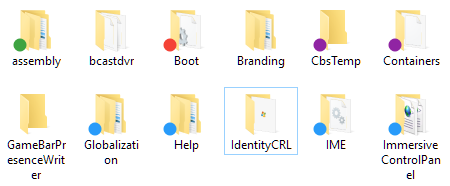

# WinColourLabels




## Инсталляция и деинсталляция
Чтобы скачать готовый к установке инсталлятор перейдите на вкладку [Releases](https://github.com/habro430/WinColourLabels/releases), далее скачайте и запустите с правами администратора файл `WinColourLabelsSetup.msi`.

Если Вы желаете установить компонент в ручном режиме, то его необходимо зарегистрировать в операционной системе Windows, это можно сделать двумя способами:

+ Интегрировав компонент в глобальный кэш сборок .NET через утилиту [`gacutils`](https://docs.microsoft.com/ru-ru/dotnet/framework/app-domains/how-to-install-an-assembly-into-the-gac), затем зарегистрировав его как COM-сервер утилитой [`regasm`](https://docs.microsoft.com/ru-ru/dotnet/framework/tools/regasm-exe-assembly-registration-tool).
+ Или разместить компонент свободно в файловой системе, а затем зарегистрировать при помощи `regasm` с параметром `/codebase`.

### Инсталляция (с использованием GAC):
```
gacutil -i WinColourLabels.dll
regasm WinColourLabels.dll
```

### Инсталляция (без использования GAC):
```
regasm /codebase WinColourLabels.dll
```

### Деинсталляция:
```
regasm /u WinColourLabels.dll
```
